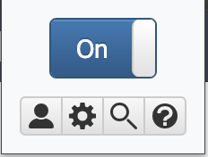

---
hide:
  - navigation
  - footer
---

This introduction will help you quickly familiarize yourself with the basics and set you up for a smooth language learning experience.

Whether you're new to Rikaitan or just need a refresher, here you'll find all the essential information you need to begin your journey.
Let's dive in and get started!

---

## Installation

Rikaitan is available for [Firefox](https://wiki.archlinux.org/title/Firefox)-based
and for [Chromium](https://wiki.archlinux.org/title/Chromium)-based web browsers.
We recommend **[LibreWolf](https://librewolf.net/)**
or [ungoogled-chromium](https://aur.archlinux.org/packages/ungoogled-chromium)
as your everyday web browser.

### Chrome

[:fontawesome-brands-chrome: Get Rikaitan <small>Chrome/Stable</small>](https://chrome.google.com/webstore/detail/rikaitan/pnjdahdadbkhcfamabafkjbjblbgkodk){ .md-button .md-button--primary .md-button--stretch }

[:fontawesome-brands-chrome: Go To Github Releases <small>All versions</small>](https://github.com/Ajatt-Tools/rikaitan/releases){ .md-button .md-button--primary .md-button--stretch }

### Firefox

[:fontawesome-brands-firefox-browser: Get Rikaitan <small>Firefox/Stable</small>](https://github.com/Ajatt-Tools/rikaitan/releases/latest){ .md-button .md-button--primary .md-button--stretch }

[:fontawesome-brands-firefox-browser: Go To Github Releases <small>All versions</small>](https://github.com/Ajatt-Tools/rikaitan/releases){ .md-button .md-button--primary .md-button--stretch }

<small>※ Firefox does not allow extensions meant for testing to be hosted in
the marketplace. You will have to download the desired version and side-load it
yourself. You only need to do this once, and you will get updates
automatically.</small>

### Mobile devices

On [Android](https://tatsumoto.neocities.org/blog/our-immersion-learning-toolset#android) devices
you can install
[Fennec](https://f-droid.org/packages/org.mozilla.fennec_fdroid/)
and then install Rikaitan from [Firefox add-ons](#firefox).

---

## Basic Usage

Now that you have installed Rikaitan, let's explore how you can utilize her features in your language learning journey.

### Quick-actions

Click the { width="16" } _Rikaitan_ button in the browser bar to open the quick-actions popup.

{ width="120" }

- The { width="16" } _profile_ button will appear when multiple profiles exist, allowing the current profile to be quickly changed.
- The { width="16" } _cog_ button will open the Settings page.
- The { width="16" } _magnifying glass_ button will open the Search page.
- The { width="16" } _question mark_ buttonwill open the Information page.

### Installing Dictionaries

To import the dictionaries you wish to use for term searches, head over to [Dictionaries](dictionaries.md) to get set up!

If you do not have any dictionaries installed or enabled. Rikaitan will warn you that it is not ready for use by displaying an orange exclamation mark over its icon. This exclamation mark will disappear once you have installed and enabled at least one dictionary.

<figure markdown="span">
    { width="550" }
</figure>

### Scanning Text

Webpage text can be scanned by moving the cursor while holding a modifier key, which is <kbd>Shift</kbd> by default.

If definitions are found for the text at the cursor position, a popup window containing term definitions will open. This window can be dismissed by clicking anywhere outside of it.

<figure markdown="span">
    <a href="https://en.wikipedia.org/wiki/English_language#Classification">
    { width="850" }
    </a>
    <figcaption><small>Try it yourself!</small></figcaption>
</figure>

### Audio

Click on the { width="16" } _speaker_ button to hear the term pronounced by a native speaker.

If an audio sample is not available, you will hear a short click instead. For more options, see [Audio Configuration](advanced.md#audio).

### Anki

To further enhance your Rikaitan experience, it's worth [integrating with Anki](anki.md), a spaced-repetition flashcard program to help solidify the words you encounter.
