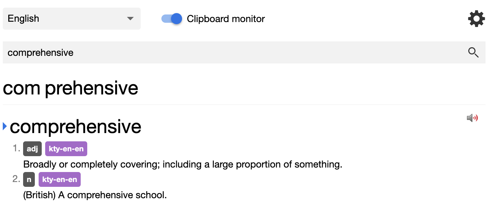

# 
Rikaitan

## 
Powerful and versatile pop-up dictionary for <a href="https://tatsumoto.neocities.org/blog/whats-ajatt" target="_blank">AJATT</a> and language learning used by 100,000+ language learners.

[:fontawesome-brands-chrome: Get Rikaitan <small>Chrome</small>](https://chrome.google.com/webstore/detail/rikaitan/pnjdahdadbkhcfamabafkjbjblbgkodk){ .md-button .md-button--primary .md-button--stretch }

[:fontawesome-brands-firefox-browser: Get Rikaitan <small>Firefox</small>](https://github.com/Ajatt-Tools/rikaitan/releases/latest){ .md-button .md-button--primary .md-button--stretch }

[Get started](getting-started.md){ .md-button .md-button--stretch }

---

## What is Rikaitan?

Unlock the full potential of AJATT with Rikaitan!
Rikaitan turns your web browser into a tool for building language literacy by helping you **read** texts that would otherwise be too difficult to tackle in [a variety of supported languages](./supported-languages.md).

-   :speech_balloon:{ .lg .middle } &nbsp;
    __Interactive Popup__

    ---

    Interactive popup definition window for displaying search results.
    { class=on-glb }

-   :mag:{ .lg .middle } &nbsp;
    __Search page__

    ---

    Search page for easily looking up words.

    { class=on-glb }

-   :loud_sound:{ .lg .middle } &nbsp;
    __Audio__

    ---

    Native pronunciation audio with the ability to add your own custom audio sources.

    { class=on-glb }

    ---

    [:octicons-arrow-right-24: More information](./advanced.md#audio)

-   :earth_asia:{ .lg .middle } &nbsp;
    __Multilanguage Support__

    ---

    Support for more than 20 languages ranging from Japanese to Spanish to Arabic.

    ---

    [:octicons-arrow-right-24: Supported languages](./supported-languages.md)

-   :pencil:{ .lg .middle } &nbsp;
    __Flashcards__

    ---

    Automatic flashcard creation for the [Anki](https://wiki.archlinux.org/title/Anki) flashcard program via the [AnkiConnect](https://ankiweb.net/shared/info/2055492159) plugin.

    { class=on-glb }

    ---

    [:octicons-arrow-right-24: More information](./anki.md)

-   :heart:{ .lg .middle } &nbsp;
    __And Much More__

    ---

    - :book: [Support for multiple dictionaries.](./dictionaries.md)
    - :material-cloud-off: Works fully offline. No internet connection needed.
    - :material-wrench: [Extremely customizable. Hotkeys, custom audio, custom appearance.](advanced.md)
    - :material-currency-usd-off: Completely free! We don't track your data and we're completely [FLOSS](https://github.com/Ajatt-Tools/rikaitan).

[Get started](getting-started.md){ .md-button .md-button--stretch-max-sm }
