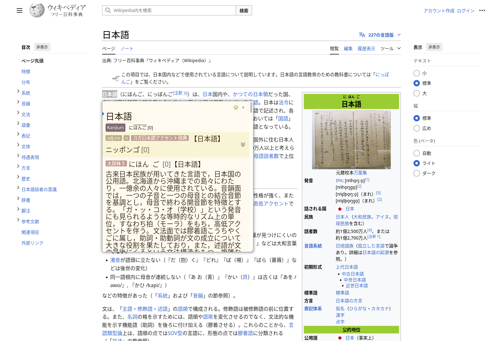
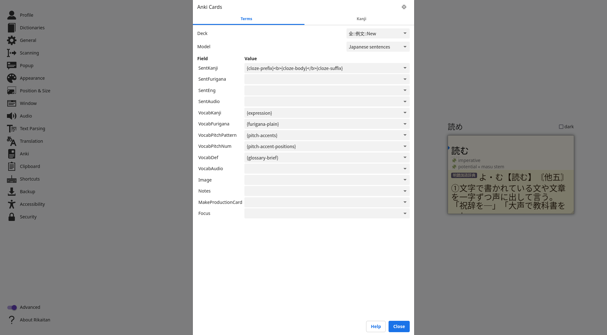

# 
**Rikaitan**

## 
Powerful, versatile and efficient pop-up dictionary for <a href="https://tatsumoto.neocities.org/blog/whats-ajatt" target="_blank">AJATT</a>.

[Get started](getting-started/index.md){ .md-button .md-button--stretch }

[:fontawesome-brands-chrome: Get Rikaitan <small>Chrome</small>](https://chrome.google.com/webstore/detail/rikaitan/pnjdahdadbkhcfamabafkjbjblbgkodk){ .md-button .md-button--primary .md-button--stretch }

[:fontawesome-brands-firefox-browser: Get Rikaitan <small>Firefox</small>](https://addons.mozilla.org/en-US/firefox/addon/rikaitan/){ .md-button .md-button--primary .md-button--stretch }

---

## What is Rikaitan?

Unlock the full potential of AJATT with Rikaitan!
Rikaitan turns your web browser into a tool for building language literacy by helping you **read** texts that would otherwise be too difficult to tackle in [a variety of supported languages](./other/supported-languages.md).

-   :speech_balloon:{ .lg .middle } &nbsp;
    __Interactive Popup__

    ---

    Interactive popup definition window for displaying search results.
    { class=on-glb }

-   :loud_sound:{ .lg .middle } &nbsp;
    __Audio__

    ---

    Built-in native pronunciation audio with the ability to add your own custom audio sources.

    ---

    [:octicons-arrow-right-24: More information](./advanced/index.md#audio)

-   :earth_asia:{ .lg .middle } &nbsp;
    __Multilanguage Support__

    ---

    Support for a variety of languages ranging from Japanese to Spanish and even Old Irish.

    ---

    [:octicons-arrow-right-24: More information](./other/supported-languages.md)

-   :pencil:{ .lg .middle } &nbsp;
    __Flashcards__

    ---

    Automatic flashcard creation for the [Anki](https://apps.ankiweb.net/) flashcard program via the [AnkiConnect](https://ankiweb.net/shared/info/2055492159) plugin.

    { class=on-glb }

    ---

    [:octicons-arrow-right-24: More information](./anki/index.md)

-   :mag:{ .lg .middle } &nbsp;
    __Custom Search__

    ---

    Custom search page for easily executing custom search queries.

-   :book:{ .lg .middle } &nbsp;
    __Dictionaries__

    ---

    Support for multiple dictionary formats including [EPWING](https://ja.wikipedia.org/wiki/EPWING) via the [Rikaitan Import](https://github.com/Ajatt-Tools/rikaitan-import) tool.

    ---

    [:octicons-arrow-right-24: More information](./dictionaries/index.md)

[Get started](getting-started/index.md){ .md-button .md-button--stretch-max-sm }
